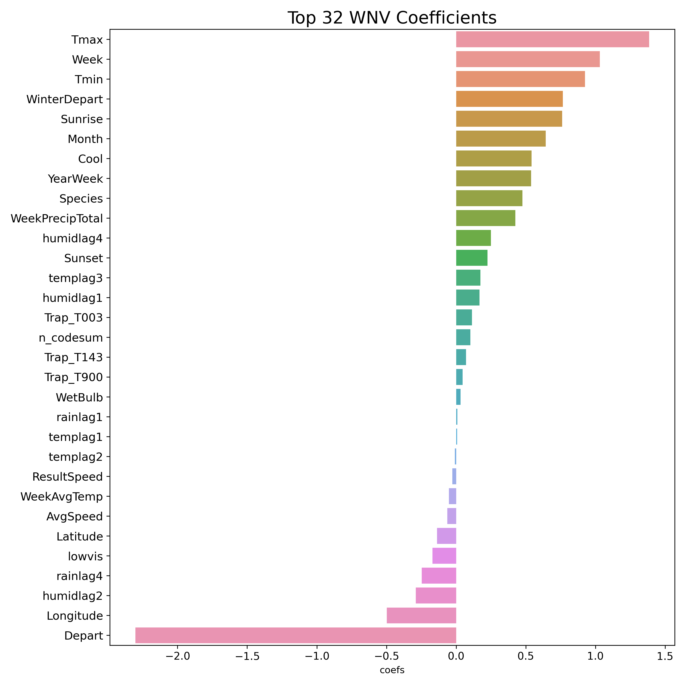

{"cells":[{"cell_type":"markdown","source":"# Project 4: West Nile Virus Prediction","metadata":{"tags":[],"cell_id":"00000-ce2f9c53-c1b0-47b4-9800-37dd367cc5a5","output_cleared":false,"deepnote_cell_type":"markdown"}},{"cell_type":"markdown","source":"Group Members: Asyraf, Benjamin, Jack, Sahaj","metadata":{"tags":[],"cell_id":"00001-b7b28a1d-b4a6-4964-87f4-6f6b6bd02c82","deepnote_cell_type":"markdown"}},{"cell_type":"markdown","source":"## Introduction","metadata":{"tags":[],"cell_id":"00001-f08267c5-3210-4751-bf7d-ea228d43b914","output_cleared":false,"deepnote_cell_type":"markdown"}},{"cell_type":"markdown","source":"The West Nile Virus (WNV) has been a serious problem for the United States since 1999. The [CDC](https://www.cdc.gov/westnile/index.html) has acknowledged it as the leading cause of mosquito-borne disease in the continental United States. However, there are no vaccines to prevent or medications to treat WNV in people -- according to the CDC, 1 in 5 people who are infected develop a fever and other symptoms, while 1 out of 150 infected people develop a serious, sometimes fatal, illness.\n\nIn Illinois, [West Nile virus was first identified in September 2001](https://www.dph.illinois.gov/topics-services/diseases-and-conditions/west-nile-virus) when laboratory tests confirmed its presence in two dead crows found in the Chicago area. The following year, the state's first human cases and deaths from West Nile disease were recorded and all but two of the state's 102 counties eventually reported a positive human, bird, mosquito or horse. By the end of 2002, Illinois had counted more human cases (884) and deaths (64) than any other state in the United States.\n\nSince then, Illinois and more specifically Chicago, has continued to suffer from multiple outbreaks of the West Nile Virus. From 2005 to 2016, a total of 1,371 human WNV cases were [reported](https://journals.plos.org/plosone/article?id=10.1371/journal.pone.0227160) within Illinois. Out of these total reported cases, 906 cases (66%) were from the Chicago region (Cook and DuPage Counties). \n\nWith this in mind, <b>our project is aimed at predicting outbreaks of the West Nile Virus</b>. This will help the City of Chicago and Chicago Department of Public Health (CDPH) more efficiently and effectively allocate resources towards preventing transmission of this potentially deadly virus. Specifically, our model will use a combination of weather, time and location features to predict the presence of WNV within mosquito traps set up throughout Chicago. ","metadata":{"tags":[],"cell_id":"00002-e4052fd6-d08a-4930-800b-be1f32091381","output_cleared":false,"deepnote_cell_type":"markdown"}},{"cell_type":"markdown","source":"## Executive Summary","metadata":{"tags":[],"cell_id":"00003-0bb622c7-f2e8-4feb-954c-3b2b804f2c7e","output_cleared":false,"deepnote_cell_type":"markdown"}},{"cell_type":"markdown","source":"Our top performing model was a Logistic Regression model (Lasso Regularization with an $\\alpha$ of 1.0), which achieved an AUC scores of <b>0.787</b> on Kaggle. This placed us among the top 15% of all teams that participated within the competition. To achieve these results, we used a range of feature engineering, selection and oversampling techniques including Synthetic Minority Over-Sampling (SMOTE).\nSome of our best predictors were temperature-related features, such as `Tmax` and `WinterDepart`. Time-based features like `Week` and `Month` were also crucial in helping our model to identify the presence of the West Nile Virus. We also saw other weather related variables like `humidlag4` play a role in our model. Location features like `Longitude` and trap location also played a minor role here.","metadata":{"tags":[],"cell_id":"00004-26cf6083-69d3-45a6-9d14-05467a18fc82","output_cleared":false,"deepnote_cell_type":"markdown"}},{"cell_type":"markdown","source":"","metadata":{"tags":[],"cell_id":"00004-16a95dfb-7f98-488b-b0f6-f1f4ec0e3f95","output_cleared":false,"deepnote_cell_type":"markdown"}},{"cell_type":"markdown","source":"<table class=\"dcf-table dcf-table-responsive dcf-table-bordered dcf-table-striped dcf-w-100%\">\n\t<caption>Model Results (Sorted by Test AUC)</caption>\n\t<thead>\n\t\t<tr>\n\t\t\t<th class=\"dcf-txt-center\" data-label=\"Model\" scope=\"col\">Model</th>\n\t\t\t<th class=\"dcf-txt-center\" data-label=\"Train AUC\" scope=\"col\">Train AUC</th>\n\t\t\t<th class=\"dcf-txt-center\" data-label=\"Test AUC\" scope=\"col\">Test AUC</th>\n\t\t\t<th class=\"dcf-txt-center\" data-label=\"Precision\" scope=\"col\">Precision</th>\n\t\t\t<th class=\"dcf-txt-center\" data-label=\"Specificity\" scope=\"col\">Specificity</th>\n\t\t\t<th class=\"dcf-txt-center\" data-label=\"Recall\" scope=\"col\">Recall</th>\n\t\t\t<th class=\"dcf-txt-center\" data-label=\"F-score\" scope=\"col\">F-score</th>\n\t\t</tr>\n\t</thead>\n\t<tbody>\n\t\t<tr>\n\t\t\t<td class=\"dcf-txt-center\" data-label=\"Model\">Logistic Regression</td>\n\t\t\t<td class=\"dcf-txt-center\" data-label=\"Train AUC\">0.858627</td>\n\t\t\t<td class=\"dcf-txt-center\" data-label=\"Test AUC\">0.823617</td>\n\t\t\t<td class=\"dcf-txt-center\" data-label=\"Precision\">0.140553</td>\n\t\t\t<td class=\"dcf-txt-center\" data-label=\"Specificity\">0.750251</td>\n\t\t\t<td class=\"dcf-txt-center\" data-label=\"Recall\">0.739394</td>\n\t\t\t<td class=\"dcf-txt-center\" data-label=\"F-score\">0.236205</td>\n\t\t</tr>\n\t\t<tr>\n\t\t\t<td class=\"dcf-txt-center\" data-label=\"Model\">Ada Boosting</td>\n\t\t\t<td class=\"dcf-txt-center\" data-label=\"Train AUC\">0.961605</td>\n\t\t\t<td class=\"dcf-txt-center\" data-label=\"Test AUC\">0.808654</td>\n\t\t\t<td class=\"dcf-txt-center\" data-label=\"Precision\">0.157986</td>\n\t\t\t<td class=\"dcf-txt-center\" data-label=\"Specificity\">0.837630</td>\n\t\t\t<td class=\"dcf-txt-center\" data-label=\"Recall\">0.551515</td>\n\t\t\t<td class=\"dcf-txt-center\" data-label=\"F-score\">0.245614</td>\n\t\t</tr>\n\t\t<tr>\n\t\t\t<td class=\"dcf-txt-center\" data-label=\"Model\">Extra Trees</td>\n\t\t\t<td class=\"dcf-txt-center\" data-label=\"Train AUC\">0.974448</td>\n\t\t\t<td class=\"dcf-txt-center\" data-label=\"Test AUC\">0.807757</td>\n\t\t\t<td class=\"dcf-txt-center\" data-label=\"Precision\">0.148900</td>\n\t\t\t<td class=\"dcf-txt-center\" data-label=\"Specificity\">0.831604</td>\n\t\t\t<td class=\"dcf-txt-center\" data-label=\"Recall\">0.533333</td>\n\t\t\t<td class=\"dcf-txt-center\" data-label=\"F-score\">0.232804</td>\n\t\t</tr>\n\t\t<tr>\n\t\t\t<td class=\"dcf-txt-center\" data-label=\"Model\">Gradient Boosting</td>\n\t\t\t<td class=\"dcf-txt-center\" data-label=\"Train AUC\">0.997995</td>\n\t\t\t<td class=\"dcf-txt-center\" data-label=\"Test AUC\">0.801529</td>\n\t\t\t<td class=\"dcf-txt-center\" data-label=\"Precision\">0.232673</td>\n\t\t\t<td class=\"dcf-txt-center\" data-label=\"Specificity\">0.948108</td>\n\t\t\t<td class=\"dcf-txt-center\" data-label=\"Recall\">0.284848</td>\n\t\t\t<td class=\"dcf-txt-center\" data-label=\"F-score\">0.256131</td>\n\t\t</tr>\n\t\t<tr>\n\t\t\t<td class=\"dcf-txt-center\" data-label=\"Model\">Random Forest</td>\n\t\t\t<td class=\"dcf-txt-center\" data-label=\"Train AUC\">0.992065</td>\n\t\t\t<td class=\"dcf-txt-center\" data-label=\"Test AUC\">0.797336</td>\n\t\t\t<td class=\"dcf-txt-center\" data-label=\"Precision\">0.177616</td>\n\t\t\t<td class=\"dcf-txt-center\" data-label=\"Specificity\">0.886843</td>\n\t\t\t<td class=\"dcf-txt-center\" data-label=\"Recall\">0.442424</td>\n\t\t\t<td class=\"dcf-txt-center\" data-label=\"F-score\">0.253472</td>\n\t\t</tr>\n\t\t<tr>\n\t\t\t<td class=\"dcf-txt-center\" data-label=\"Model\">Support Vector Machine</td>\n\t\t\t<td class=\"dcf-txt-center\" data-label=\"Train AUC\">0.938088</td>\n\t\t\t<td class=\"dcf-txt-center\" data-label=\"Test AUC\">0.778879</td>\n\t\t\t<td class=\"dcf-txt-center\" data-label=\"Precision\">0.140950</td>\n\t\t\t<td class=\"dcf-txt-center\" data-label=\"Specificity\">0.806160</td>\n\t\t\t<td class=\"dcf-txt-center\" data-label=\"Recall\">0.575758</td>\n\t\t\t<td class=\"dcf-txt-center\" data-label=\"F-score\">0.226460</td>\n\t\t</tr>\n\t\t<tr>\n\t\t\t<td class=\"dcf-txt-center\" data-label=\"Model\">Decision Tree</td>\n\t\t\t<td class=\"dcf-txt-center\" data-label=\"Train AUC\">0.989197</td>\n\t\t\t<td class=\"dcf-txt-center\" data-label=\"Test AUC\">0.724557</td>\n\t\t\t<td class=\"dcf-txt-center\" data-label=\"Precision\">0.157360</td>\n\t\t\t<td class=\"dcf-txt-center\" data-label=\"Specificity\">0.888852</td>\n\t\t\t<td class=\"dcf-txt-center\" data-label=\"Recall\">0.375758</td>\n\t\t\t<td class=\"dcf-txt-center\" data-label=\"F-score\">0.221825</td>\n\t\t</tr>\n\t</tbody>\n</table>","metadata":{"tags":[],"cell_id":"00006-979a9b5a-f1ca-4873-9096-64201a3ac876","deepnote_cell_type":"markdown"}},{"cell_type":"markdown","source":"We also chose the Logisitc Regression model due to it's high recall score. Given that the West Nile Virus can lead to human death, it's imperative for false negatives to be minimized and for true positives to be maximized. Our Logistic Regression model has by far the best recall score out of all the other models (0.74) though it has weak precision and specificity scores, but we believe that this is a fair trade off as \nincorrectly predicting the lack of WNV can increase chances of an outbreak, leading to potential snowball effects on hospitalization rates and the economy. \n","metadata":{"tags":[],"cell_id":"00006-ecb641b5-c914-49d5-8406-d8fcaaac1f85","deepnote_cell_type":"markdown"}},{"cell_type":"markdown","source":"## Recommendations","metadata":{"tags":[],"cell_id":"00007-5d44cf7a-1a77-4906-8958-76ad8bf71356","deepnote_cell_type":"markdown"}},{"cell_type":"markdown","source":"Our model has shown that certain areas are particularly 'dense' in terms of WNV-positive pools and pool proximity. In conjunction to this, our model also predicted several traps that have a 80% probability or greater of a WNV outbreak. \nWe believe that the neighborhoods in which these traps are located should be an immediate focus for mosquito control efforts. These areas have been highlighted with a red circle below.\n\nWe've extrapolated that these are the neighborhoods that have a high risk of WNV:\n- Elk Grove Village (7,500 acres)\n- Des Plains (9,000 acres)\n- Norridge (1,100 acres)\n- Lincolnwood (1,700 acres)\n- Stickney (1,200 acres)\n- Forest View (900 acres)\n- Morton Grove (3,100 acres)\n\nAround 24,500 acres of area in Chicago identified as high risk, housing an approximate population of 148,500 people.\n","metadata":{"tags":[],"cell_id":"00010-c6d01ba8-0c23-459b-955d-7f1bc1899da9","deepnote_cell_type":"markdown"}},{"cell_type":"markdown","source":"","metadata":{"tags":[],"cell_id":"00011-b0331c3d-3a4f-4b17-a1e9-c1686804c087","deepnote_cell_type":"markdown"}},{"cell_type":"markdown","source":"We recommend using the following methods to deal with areas with a high WNV risk:\n\n<b>Automation with drones</b>\n\nDrones can serve multiple purposes when it comes to combatting WNV: \n\n1. They can collect aerial images that can be used analyzed to identify and map breeding sites—such as cisterns, pots and buckets, \nold tires and flower pots. These images can be aggregated into accurate maps to support targeted application of larvicides \n(insecticides that specifically target the larval stage of an insect) at these potential breeding sites.\n2. Once larval habitats are identified, drones can be equipped to carry and apply larvicides and/or adulticides to small targeted areas. \nThese drones can also be fitted with a global positioning system (GPS) that can track flight patterns in conjunction with insecticide application. \nAn operator can remotely pilot the drone or, in some cases, autopilot programs may be available for pre-programmed flights. Drones can be \nuseful to target specific areas with larvicides or adulticides, as an alternative to truck-mounted applications that may require a \nhigh degree of drift of droplets in order to reach a target area in remote locations. These drones can spray potentially up to 80 acres in a day's work.\n\nIn summary, drones could be more environmentally friendly than doing the same spraying procedure on foot, and are likely to be a lot more accurate due to the ability \nto spray from a fully-vertical angle.\n\n<b>Adoption of best practices</b>\n\nThe city of Chicago can aim to reduce spraying target areas by adopting guidelines from tropical countries like [Singapore](https://www.nea.gov.sg/dengue-zika/stop-dengue) that have proven to be successfully \nin combatting mosquito-borne viruses. For example, this could involve active on-the-ground checks of homes and premises for mosquito habitats, where public officers \nprovide advice on steps you can take to prevent mosquito breeding and impose penalties if premises are found with mosquito breeding.\n\nThrough automation and more efficient mosquito vector control processes, we can reduce the cost of spraying, \nenabling the city of Chicago to save human lives and prevent further outbreaks of the West Nile Virus.","metadata":{"tags":[],"cell_id":"00008-cdb7ba56-a122-4763-9b2c-78ecfba4182d","deepnote_cell_type":"markdown"}},{"cell_type":"markdown","source":"## Data Dictionary","metadata":{"tags":[],"cell_id":"00013-d5105202-3ebe-41fa-9803-0511ab4ed96e","deepnote_cell_type":"markdown"}},{"cell_type":"markdown","source":"| Name                   | Dataset    | Type     | Description                                                                                                                                                                                                                                                  |\n|------------------------|------------|----------|--------------------------------------------------------------------------------------------------------------------------------------------------------------------------------------------------------------------------------------------------------------|\n| Id                     | train/test | int      | ID number of the record                                                                                                                                                                                                                                      |\n| Date                   | train/test | datetime | Date the WNV test was performed                                                                                                                                                                                                                              |\n| Address                | train/test | datetime | Approximate trap address retrieved from   GeoCoder                                                                                                                                                                                                           |\n| Species                | train/test | str      | Mosquito species in trap                                                                                                                                                                                                                                     |\n| Block                  | train/test | str      | Block Number of address                                                                                                                                                                                                                                      |\n| Street                 | train/test | str      | Street of address                                                                                                                                                                                                                                            |\n| Trap                   | train/test | str      | ID number of the trap                                                                                                                                                                                                                                        |\n| AddressNumberAndStreet | train/test | str      | Approximate address retrieved from   GeoCoder                                                                                                                                                                                                                |\n| Latitude               | train/test | float    | Latitude retrieved from GeoCoder                                                                                                                                                                                                                             |\n| Longitude              | train/test | float    | Longitude retrieved from GeoCoder                                                                                                                                                                                                                            |\n| AddressAccuracy        | train/test | int      | Accuracy of information returned from   GeoCoder                                                                                                                                                                                                             |\n| NumMosquitos           | train      | int      | Number of mosquitoes in a sample                                                                                                                                                                                                                             |\n| WnvPresent             | train      | int      | Whether or not WNV is present in a sample   (1 = present; 0 = absent)                                                                                                                                                                                        |\n| Station                | weather    | str      | Station 1 or 2                                                                                                                                                                                                                                               |\n| Date                   | weather    | datetime | Date of measurement (YY/MM/DD)                                                                                                                                                                                                                               |\n| Tmax                   | weather    | float    | The highest temperature for the day in   degrees Fahrenheit (F).                                                                                                                                                                                             |\n| Tmin                   | weather    | float    | The lowest temperature for the day in   degrees Fahrenheit (F).                                                                                                                                                                                              |\n| Tavg                   | weather    | float    | The average temperature for the day in degrees Fahrenheit (F).                                                                                                                                                                                               |\n| Depart                 | weather    | float    | Departure from normal temperature. The difference between column 4 and   the 30 year normal temperature for this date. A minus (-) is number of   degrees below normal. A zero (0) indicates that the average for that day was   the normal temperature. (F) |\n| DewPoint               | weather    | float    | Average Dew Point temperature (F)                                                                                                                                                                                                                            |\n| WetBulb                | weather    | float    | Average Wet Bulb temperature (F)                                                                                                                                                                                                                             |\n| Heat                   | weather    | float    | Heating Degree Days base 65F, season begins with July.                                                                                                                                                                                                       |\n| Cool                   | weather    | float    | Cooling Degree Days base 65F, season begins with January.                                                                                                                                                                                                    |\n| Sunrise                | weather    | float    | Time of sunrise                                                                                                                                                                                                                                              |\n| Sunset                 | weather    | float    | Time of sunset                                                                                                                                                                                                                                               |\n| CodeSum                | weather    | str      | Significant weather phenomena                                                                                                                                                                                                                                |\n| Depth                  | weather    | float    | Snow depth on the ground to the nearest inch                                                                                                                                                                                                                 |\n| Water1                 | weather    | float    | Water Equivalent in inches                                                                                                                                                                                                                                   |\n| SnowFall               | weather    | float    | Total snowfall for the day to the nearest tenth of an inch.                                                                                                                                                                                                  |\n| PrecipTotal            | weather    | float    | Total  precipitation for the day to the nearest hundredth of an   inch. This includes all forms of precipitation, both liquid and water   equivalent of any snow or ice that occurred                                                                        |\n| StnPressure            | weather    | float    | Average station pressure in hg (inches)                                                                                                                                                                                                                      |\n| SeaLevel               | weather    | float    | Average sea level pressure in hg (inches)                                                                                                                                                                                                                    |\n| ResultSpeed            | weather    | float    | Resultant Wind Speed - Vector sum of wind speeds divided by number of   observations (MPH)                                                                                                                                                                   |\n| ResultDir              | weather    | float    | Resultant Wind Direction - Vector sum of wind divided by number of   observations (in tens of degrees)                                                                                                                                                       |\n| AvgSpeed               | weather    | float    | Average wind speed (MPH)                                                                                                                                                                                                                                     |\n|        Date            | spray      | datetime | The date the pesticide was sprayed (YY/MM/DD)                                                                                                                                                                                                                |\n| Time                   | spray      | datetime | Time of spray                                                                                                                                                                                                                                                |\n| Latitude               | spray      | float    | The latitude of the location sprayed.                                                                                                                                                                                                                        |\n| Longitude              | spray      | float    | The longitude of the location sprayed.                        ","metadata":{"tags":[],"cell_id":"00015-15119870-b17d-471b-815a-1731883adf2e","deepnote_cell_type":"markdown"}},{"cell_type":"markdown","source":"","metadata":{"tags":[],"cell_id":"00016-d1d8fcdc-8b07-4fc3-8cf1-77f8f5c405af","deepnote_cell_type":"markdown"}}],"nbformat":4,"nbformat_minor":2,"metadata":{"orig_nbformat":2,"deepnote_notebook_id":"0cb2dfb3-e326-4146-ae72-6f537998b136","deepnote_execution_queue":[]}}